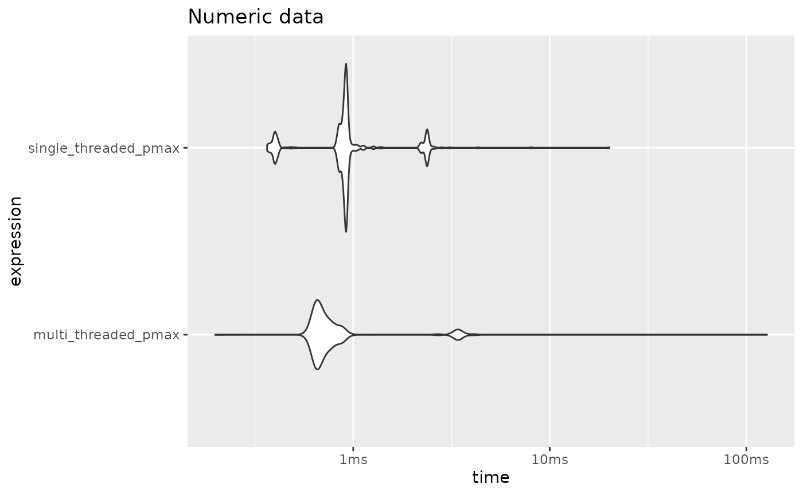
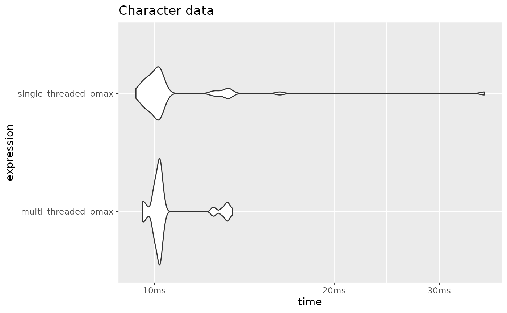
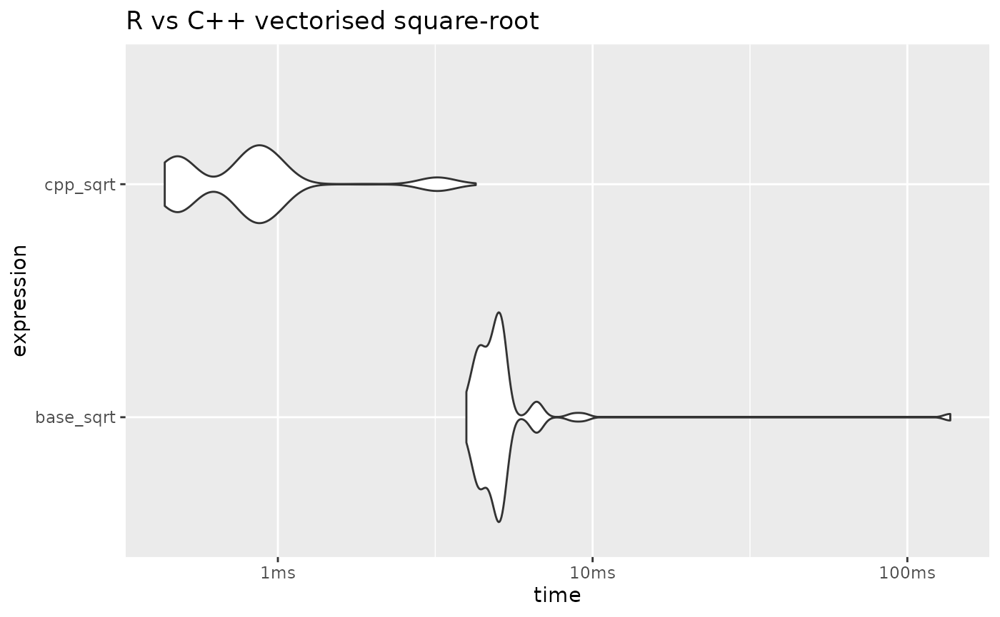
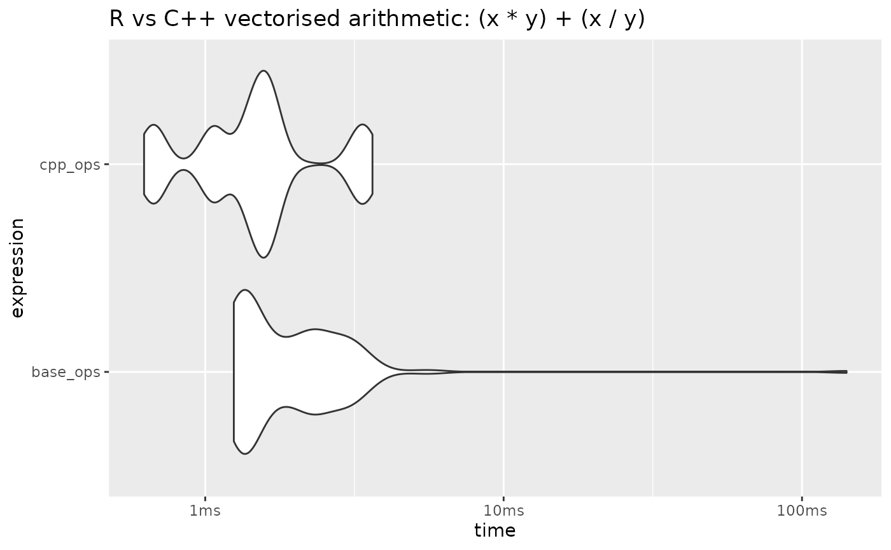

# Functional Programming with cppally

This vignette is mainly a gallery of examples, serving to provide
intuition behind the usage of cppally functionals, as well as showcasing
their utility.

### A note on writing code in C++ versus R

Working with scalars demands a different mental model to the one R
typically encourages.

In R we usually vectorise everything upfront by using vectors and
vectorised operations everywhere possible. For R this is both cleaner
and more efficient. In C++ the reverse is true. It is arguably cleaner
to write functions at the scalar level, and then **vectorise after the
fact**.

As will soon be demonstrated in this vignette, `pmap()` exists to bridge
that final step of taking **scalar-based** functions and vectorising[^1]
them.

Let’s load cppally in R and include cppally in our cpp or header file to
get started.

``` r

library(cppally)
```

``` cpp
// Include this if you are copying the code example-by-example
#include <cppally.hpp>
using namespace cppally;
```

### pmap

`pmap` is a C++ variadic function that allows one to apply a function
across corresponding elements of multiple vectors.

**Example:** vectorised binary max

``` cpp

[[cppally::register]]
r_vector<r_dbl> cpp_pmax(r_vector<r_dbl> x, r_vector<r_dbl> y){
    return pmap(
    
    /* fn = */ [](auto a, auto b){
    
      /* expr = */ return max(a, b);
        
    }, 
    
    /* vectors = */ x, y
  );
}
  
```

``` r

x <- c(10, 20, 30)
y <- c(10, 50, 0)
cpp_pmax(x, y)
#> [1] 10 50 30

# pmap also recycles vectors

cpp_pmax(x, 15)
#> [1] 15 20 30
```

**Example:** vectorised if else

``` cpp

template <RVector T>
[[cppally::register]]
T cpp_if_else(r_vector<r_lgl> condition, T if_true, T if_false, T if_na){
    return pmap(
      [](r_lgl condition_, auto yes, auto no, auto missing) {
        if (condition_.is_true()){
            return yes;
        } else if (condition_.is_false()){
            return no;
        } else {
            return missing;
        }
    }, 
    
    condition, if_true, if_false, if_na
  );
}
```

``` r

cpp_if_else(c(TRUE, FALSE, NA), "yes", "no", "missing")
#> [1] "yes"     "no"      "missing"
```

`pmap_with_index()` is a variant that allows one to capture the index as
we iterate along the vector

**Example:** Integer sequence along vector

``` cpp

template <RVector T>
[[cppally::register]]
r_vector<r_int> cpp_seq_along(T x){
    return pmap_with_index([](r_size_t i, auto){ // 2nd arg included so function can compile
        return as<r_int>(i) + 1; // R is 1-indexed
    }, x);
}
```

``` r

cpp_seq_along(letters)
#>  [1]  1  2  3  4  5  6  7  8  9 10 11 12 13 14 15 16 17 18 19 20 21 22 23 24 25
#> [26] 26
```

### reduce

`r_vector::reduce()` is a left-fold reduction functional that
successively applies a binary function along the elements of the vector
(from left-to-right). It allows for returning early and explicitly
continuing by calling `done()` and `keep()`. The input function is
typically a lambda, but can also be a callable (struct with
`operator()`).

Example of summing a vector with `reduce`

``` cpp

[[cppally::register]]
r_dbl cpp_sum(r_vector<r_dbl> x){
    return x.reduce([](auto a, auto b){ return a + b; });
}
```

``` r

cpp_sum(1:10)
#> [1] 55
```

We could have also passed the callable `std::plus<>{}`, which makes it
even more readable.

``` cpp

[[cppally::register]]
r_dbl cpp_sum2(r_vector<r_dbl> x){
    return x.reduce(std::plus<>{});
}
```

``` r

cpp_sum2(1:10)
#> [1] 55
```

Use `cumulative_reduce` to return a vector of all the intermediate
results of the reduction.

``` cpp

[[cppally::register]]
r_vector<r_dbl> cpp_cumsum(r_vector<r_dbl> x){
    return x.cumulative_reduce(std::plus<>{});
}
  
```

``` r

cpp_cumsum(1:10)
#>  [1]  1  3  6 10 15 21 28 36 45 55
```

While the above examples are useful for showing how to write a sum by
hand, cppally provides [`sum()`](https://rdrr.io/r/base/sum.html) for
free.

``` cpp

[[cppally::register]]
r_dbl cpp_sum3(r_vector<r_dbl> x){
    return sum(x);
}
```

``` r

cpp_sum3(c(10, 20, 30))
#> [1] 60
```

#### Returning early

To perform a reduction until a condition is met, use the helpers
`done()` and `keep()`

**Example:** Check vector has any `NA` or all `NA`

``` cpp

[[cppally::register]]
bool cpp_any_na(r_vector<r_dbl> x){
    return x.reduce([](auto, auto curr){ return is_na(curr) ? done(true) : keep(false); }, /*init = */ false);
}

[[cppally::register]]
bool cpp_all_na(r_vector<r_dbl> x){
    return x.reduce([](auto, auto curr){ return is_na(curr) ? keep(true) : done(false); }, /*init = */ true);
}
  
```

``` r

x <- c(1, 2, NA, 4, 5)
cpp_any_na(x)
#> [1] TRUE
cpp_all_na(x)
#> [1] FALSE
```

Notice that the two folds are identical - only `done`/`keep` and `init`
are swapped. This is the general pattern for any/all-style predicates.

**Example:** greatest-common-divisor across integer vector. The trick
here is to break when the result is 1 as `gcd(1, x) = 1` for any x.

``` cpp

[[cppally::register]]
r_int cpp_gcd(r_vector<r_int> x){
    return x.reduce([](auto acc, auto curr){
    
        auto res = cppally::gcd(acc, curr); // cppally has its own NA-aware gcd
        
        if ( (res == 1).is_true() ){
            return done(res);
        } else {
            return keep(res);
        }
        
    });
}
  
```

``` r

cpp_gcd(c(5L, 25L, 125L))
#> [1] 5
cpp_gcd(c(5L, 25L, 1L, 125L))
#> [1] 1
```

### Other pmap helpers

There are 2 core pmap functionals, with 9 variants in total.

**Core pmap functionals**

- `pmap` - Applies a function across elements.

- `pmap_with_index` - Like `pmap` but the first argument of the lambda
  must be an index.

**Other pmap variants**

- `pmap_parallel` - Like `pmap` but executed using multiple threads

- `pmap_simd` - Like `pmap` but executed under OpenMP SIMD instructions

- `pmap_parallel_simd` - Like `pmap` but multi-threaded and executed
  under OpenMP SIMD instructions

- `pmap_parallel_with_index` - Like `pmap_with_index` but executed using
  multiple threads

- `pmap_simd_with_index` - Like `pmap_with_index` but executed under
  OpenMP SIMD instructions

- `pmap_parallel_simd_with_index` - Like `pmap_with_index` but executed
  using multiple threads and under OpenMP SIMD instructions

- `pmap_with_shift` - A convenient wrapper around `pmap` to work with
  lagged values. Positional helpers `lag(k)`, `lead(k)`, `curr()` must
  be used to access lagged values. `lag_exists()` and `lead_exists()`
  can be used to test for out-of-bounds indexing. Out-of-bounds indexing
  returns `NA` by default, though this default can be changed in
  [`lag()`](https://rdrr.io/r/stats/lag.html) and `lead()`.

#### Multi-threading safety

All `pmap` variants try very hard to avoid unsafe multi-threaded calls
to R C API entry-points. Multi-threaded and/or SIMD execution only
applies for `RVectorisable` types, meaning that for types like `r_str`
which are not inherently thread-safe, execution is **always
single-threaded** and **non-SIMD**, even if you request multiple threads
or SIMD.

To illustrate this, let’s revisit our `pmax` from earlier but this time
using `pmap_parallel` and with a template that accepts `r_dbl` or
`r_str` vectors.

``` cpp

 
// Allows us to set threads and automatically restore them once thread_guard is destroyed (even if R aborts)
struct thread_guard {

  int curr_threads;
  
  // Set threads and store previous threads
  thread_guard(int n) {
    curr_threads = get_threads();
    set_threads(n);
  }
  
  // Restore threads on destruction
  ~thread_guard() {
    set_threads(curr_threads);
  }
  
};
template <typename F>
decltype(auto) with_threads(int n, F&& f) {
  thread_guard guard(n);
  return std::forward<F>(f)();
}
 
template <typename T>
requires (any<T, r_dbl, r_str>) // doubles or strings
[[cppally::register]]
r_vector<T> cpp_parallel_pmax(r_vector<T> x, r_vector<T> y, int n_threads){
    return with_threads(n_threads, [&]{
    
      return pmap_parallel(
      [](const auto& a, const auto& b){
          return max(a, b);
      }, 
      x, y
    );
  });
}
  
```

We can detect whether or not multiple threads were used by observing
benchmark time.

``` r

library(bench)
library(ggplot2)

x <- as.double(rpois(5e05, lambda = 10))
y <- as.double(rpois(5e05, lambda = 15))

(
  mark(
    single_threaded_pmax = cpp_parallel_pmax(x, y, n_threads = 1),
    multi_threaded_pmax = cpp_parallel_pmax(x, y, n_threads = 4)
  ) |> 
    autoplot(type = "violin") 
) +
  labs(title = "Numeric data")
```



We can see that the same benchmarks on character vector data yield
identical results between the one requesting 1 thread and the one
requesting 4 threads. Even though we request 4 threads, it still gets
executed as single-threaded.

``` r


x <- as.character(x)
y <- as.character(y)

(
  mark(
    single_threaded_pmax = cpp_parallel_pmax(x, y, n_threads = 1),
    multi_threaded_pmax = cpp_parallel_pmax(x, y, n_threads = 4)
  ) |> 
    autoplot(type = "violin") 
) +
  labs(title = "Character data")
```



### Lagged operations

Use `pmap_with_shift` to perform lagged operations. It checks for
out-of-bounds access and therefore is safer than hand-writing it via
`pmap_with_index`

``` cpp

[[cppally::register]]
r_vector<r_int> cpp_lag(r_vector<r_int> x, int k){
    return pmap_with_shift([&](auto a){
        return lag(a, k);
    }, x);
}
```

``` r

# Lags
cpp_lag(1:10, k = 1)
#>  [1] NA  1  2  3  4  5  6  7  8  9
cpp_lag(1:10, k = 2)
#>  [1] NA NA  1  2  3  4  5  6  7  8
cpp_lag(1:10, k = 3)
#>  [1] NA NA NA  1  2  3  4  5  6  7

# Leads
cpp_lag(1:10, k = -1)
#>  [1]  2  3  4  5  6  7  8  9 10 NA
cpp_lag(1:10, k = -2)
#>  [1]  3  4  5  6  7  8  9 10 NA NA
cpp_lag(1:10, k = -3)
#>  [1]  4  5  6  7  8  9 10 NA NA NA
```

`pmap_with_shift` has five helpers:
[`lag()`](https://rdrr.io/r/stats/lag.html), `lead()`, `curr()`,
`lag_exists()`, and `lead_exists()`. These are designed to assist in
performing efficient lagged operations in a vectorised context, while
maintaining readability.

**Example:** Lagged differencing

``` cpp

[[cppally::register]]
r_vector<r_dbl> cpp_diff(r_vector<r_dbl> x){
    return pmap_with_shift([&](auto a){
        return curr(a) - lag(a);
    }, x);
}
```

``` r

cpp_diff(1:10)
#>  [1] NA  1  1  1  1  1  1  1  1  1
cpp_diff(seq(10, 100, by = 5))
#>  [1] NA  5  5  5  5  5  5  5  5  5  5  5  5  5  5  5  5  5  5
```

### In-place functionals

To perform in-place transformations, use `r_vector::apply` as `pmap`
always allocates a fresh vector and therefore cannot do in-place
modification. `apply` comes in the same flavours as `pmap` -
`apply_simd`, `apply_parallel`, `apply_parallel_simd`, and the
`_with_index` variants.

``` cpp

[[cppally::register]]
r_vector<r_dbl> cpp_in_place_abs(r_vector<r_dbl>& x){
    x.apply([](auto a){ return abs(a); });
    return x;
}
```

``` r

x <- c(-20, -10)
cpp_in_place_abs(x)
#> [1] 20 10

x # Modified in-place
#> [1] 20 10
```

`r_vector::shift` is a helper which can shift an entire vector in-place.
It takes shift `k` and an optional `fill_value` which defaults to `NA`.

``` cpp

[[cppally::register]]
r_vector<r_dbl> cpp_in_place_lag(r_vector<r_dbl>& x, int k){
    x.shift(k);
    return x;
}
```

``` r

x <- c(1, 2, 3, 4, 5)
cpp_in_place_lag(x, k = 1)
#> [1] NA  1  2  3  4
x # lagged in-place
#> [1] NA  1  2  3  4

# keep lagging until we run out of elements to lag
cpp_in_place_lag(x, k = 1)
#> [1] NA NA  1  2  3
cpp_in_place_lag(x, k = 1)
#> [1] NA NA NA  1  2
cpp_in_place_lag(x, k = 1)
#> [1] NA NA NA NA  1
cpp_in_place_lag(x, k = 1)
#> [1] NA NA NA NA NA
```

### Vectorised math

`pmap` also makes it easy to write vectorised math functions.

**Example:** Vectorised square-root

cppally provides a scalar version of
[`sqrt()`](https://rdrr.io/r/base/MathFun.html), which can be easily
vectorised with `pmap`.

``` cpp


[[cppally::register]]
r_vector<r_dbl> cpp_sqrt(r_vector<r_dbl> x){
    return pmap_parallel_simd(
      [](auto v){
        return sqrt(v);
      }, 
    x
  );
}
```

Here we are using `pmap_parallel_simd`, a variant of `pmap` that applies
the supplied transformation under multiple threads and under an OpenMP
SIMD directive. SIMD (single-instruction-multiple-data) is when the
machine performs the same operation on multiple data points instead of
one data point at time.

Let’s benchmark this against
[`base::sqrt()`](https://rdrr.io/r/base/MathFun.html), but first let’s
use 4 threads for the rest of the examples in this vignette.

``` cpp


[[cppally::register]]
void cpp_set_threads(int n){
  set_threads(n);
}
```

``` r

cpp_set_threads(4) # Set 4 threads for the rest of the vignette
```

``` r

x <- rnorm(5e05, mean = 50)

(
  mark(
    base_sqrt = sqrt(x),
    cpp_sqrt = cpp_sqrt(x)
  ) |> 
    autoplot(type = "violin")
) + 
  labs(title = "R vs C++ vectorised square-root")
```



For more math functions, see `cppally/math/math.h`, a header containing
a rich set of cppally math functions.

cppally also provides quite a few vectorised operators out-of-the-box.
The vectorised operators currently defined:

binary: `+,-,*,/,+=,-=,*=,/=,==,<=,<,>=,>,|,&`

unary: `!,-`

When it comes to arithmetic operations, both cppally and R are heavily
optimised to use in-place modification where possible. This greatly
improves performance when multiple arithmetic operations are chained one
after the other.

Since R is heavily optimised in this case, any performance gains cppally
makes over R are likely to come from using multiple threads.

``` cpp


[[cppally::register]]
r_vector<r_dbl> cpp_arithmetic_ops(r_vector<r_dbl> x, r_vector<r_dbl> y){
  return (x * y) + (x / y); // Already vectorised and heavily optimised by cppally!
}
```

``` r

y <- rnorm(5e05)

(
 mark(
   base_ops = (x * y) + (x / y),
   cpp_ops = cpp_arithmetic_ops(x, y)
 ) |> 
    autoplot(type = "violin")
) + 
  labs(title = "R vs C++ vectorised arithmetic: (x * y) + (x / y)")
```



[^1]: Vectorising in the R sense, not the SIMD
    (single-instruction-multiple-data) sense. In R, vectorising
    literally means taking a fully or partially scalar-based function
    and expanding the domain of the scalar inputs (or outputs) into the
    vector domain.
